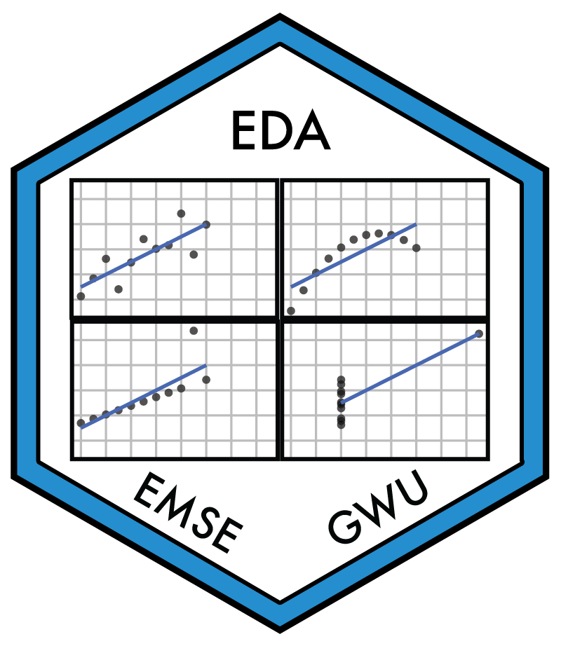

---
output:
  github_document:
    html_preview: false
---

<!-- README.md is generated from README.Rmd. Please edit that file -->

```{r setup, include = FALSE}
knitr::opts_chunk$set(
  collapse = TRUE,
  results = "asis",
  echo = FALSE,
  comment = "#>",
  out.width = "100%"
)
IS_README <- TRUE
```

## EMSE 4197: Exploratory Data Analysis - Spring 2020 

<!-- badges: start -->

[](https://creativecommons.org/licenses/by/4.0/)
[](https://opensource.org/licenses/MIT)
<!-- badges: end -->

### Description

```{r child = '_description.Rmd'}
```

For more details, please see the [course website](http://eda.seas.gwu.edu/2020-Spring/).

### Acknowledgments

This course was inspired by many other courses / resources that cover similar material - see the course [about page](http://eda.seas.gwu.edu/2020-Spring/about.html) for more details.
