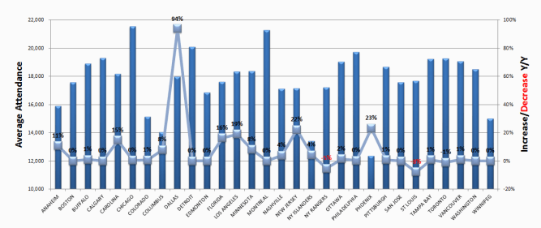

```{r setup, include=FALSE, message=FALSE, warning=FALSE}
knitr::opts_chunk$set(
    warning    = FALSE,
    message    = FALSE,
    fig.align  = "center")
library(tidyverse)
library(readxl)
library(here)
library(cowplot)
library(readxl)
library(janitor)
library(scales)
options(
  dplyr.width = Inf,
  scipen = 999)
```

**Due**: 27 March, 11:00 pm

**Weight**: This assignment is worth 8% of your final grade.

**Purpose**: This assignment is designed to be a final practice run before we will shift our focus towards the class projects. You will practice and further hone skills you have already developed to prepare you for similar challenges that you may run into in your projects.

**Skills & Knowledge**: In this assignment, you will practice exploring data in which _time_ in a central variable. Your analysis will involve writing text and code to create a reproducible document in the form of an html page.

**Assessment**: I will use [this rubric](assignments/a7/a7-rubric.pdf) to grade the finished product.

**Background**: The author of [this article](https://nhltoseattle.com/2013/02/10/nhl-attendance-through-feb-9th/) from 7 years ago wrote about how attendance at NHL games was climing. In an effort to communicate this message, the author created this, um...unfortunate chart:

<center>
<br>

</center>
<br>

**Tasks**:

For this assignment, you will use the **ggplot2** library in R and [data from ESPN](http://www.espn.com/nhl/attendance/_/year/2018) to explore this question:

**How has NHL game attendence changed over the past two decades?**

Here's what you need to do:

1. **Download** [this .zip file](assignments/a7/a7-template.zip). It contains a `analysis.Rmd` file that you should use as a template to write your analysis in, a `data` folder with the relevant data needed for this assignment, and a `project.RProj` file to help you stay organized.

2. **Clean** the data. Read in the file `NHL_Attendance.xlsx` in the `data` folder. Write code to preview the data. Take note of the type of each variable and whether there are any missing values. Are all the variables encoded the way you would expect? Write code to modify variable types and names to get your data frame cleaned up for analysis. (**Hint**: The `janitor::clean_names()` function will come in handy). When you're done cleaning your data, write a few sentences describing any modifications you made to the original data and why you did it.

```{r, echo=FALSE, include=FALSE}
tb <- read_excel(here::here(
  'assignments', 'a7', 'data', 'NHL_Attendance.xlsx')) %>%
    clean_names() %>%
    filter(team == 'Tampa Bay') %>%
    select(season, home = home_attendance,
           road = road_attendance, total = total_attendance)
tb_00 <- tb %>% filter(season == '2000-01')
tb_17 <- tb %>% filter(season == '2017-18')
```

3. **Create** some new variables. First, use the `SEASON` variable to create a new variable representing the year stored as a number. For example, for the season `"2017-18"`, the year should be the number `2017`. Also, remember that we are interested in assessing the _change_ in NHL game attendance over time. To facilitate that, create a variable for the percentage change in attendance for each team in each season relative to the first season in the data (`"2000-01"`). For example, Tampa Bay's attendance at home was `r comma(tb_00$home)` in the 2000-01 season and grew to `r comma(tb_17$home)` in the 2017-18 season. Thus, the percentage growth in home attendance between these two seasons was 100*(`r comma(tb_17$home)` - `r comma(tb_00$home)`) / `r comma(tb_00$home)` = `r percent((tb_17$home - tb_00$home) / tb_00$home)`. You should end up with three new variables (growth in "home", "road", and "total" attendance) that store the percentage growth for each team and each season relative to the `"2000-01"` season.

4. **Summarize** the data. Examine measures of centrality and variability in the important variables relevant to our research question, including the new variables you created in step 3.

5. **Visualize** the data. The original chart is pretty terrible, so we're going to just scratch that and start over. Create an appropriate visualization that highlights the _change_ in NHL game attendance for each team in each season since the 2000-01 season. You are free to use whatever chart type you wish--even an animation if you want! (**Hint**: review the slides from week 6 for some ideas!). Your chart should follow the design principles we have covered in class, and it should be "polished" following the techniques we covered in week 8.

6. **Visualize** the data (again). While the first visualization highlights the _change_ in NHL game attendance for each team, this second chart should highlight the overall trend across **all** teams. To do this, you will probably need to create a summary data frame from your original one. Again, you are free to use whatever chart type you wish, but your chart should follow the design principles we have covered in class and it should be "polished".

7. **Write** a summary of your analysis. I'm specifically looking for a discussion of the following:

    - What was wrong with the original chart? Discuss specific design principles we have covered in class.
    - Discuss the message you intended to convey with each of your charts and how your design choices draw attention to that message.

8. **Click** the "knit" button to compile your `.Rmd` file into a html web page.

9. **Create** a zip file of your whole project (.Rmd, .html, .RProj, and the data folder), then go to the "Assignment Submission" page on Blackboard and submit your zip file.
