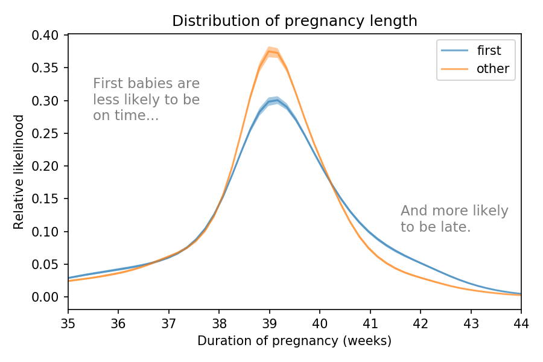
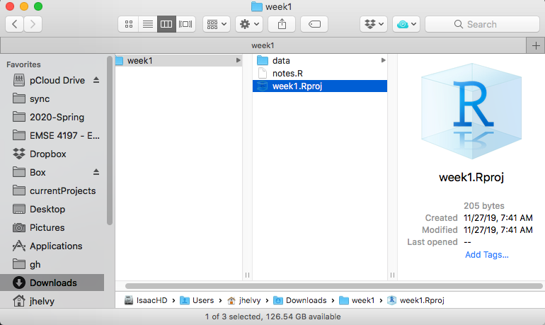

```{r setup, include=FALSE}
library(knitr)
library(here)
library(tidyverse)
library(cowplot)
library(ggrepel)
library(readxl)
library(fontawesome) # from github: https://github.com/rstudio/fontawesome
options(
    htmltools.dir.version = FALSE,
    knitr.table.format = "html",
    knitr.kable.NA = '')
knitr::opts_chunk$set(
    warning = FALSE,
    message = FALSE,
    fig.retina = 3)
```

name: xaringan-title
class: title-slide, center, middle, inverse

# Week 1: Exploratory Data Analysis

.large[EMSE 4197 | John Paul Helveston | January 15, 2020]

---
# Meet your instructor!

.leftcol30[

]
.rightcol70[
**Dr. John Helveston**

Assistant Professor in Engineering Management & Systems Engineering

**Background**:

- 2016 PhD in Engineering & Public Policy at Carnegie Mellon University
- 2015 MS in Engineering & Public Policy at Carnegie Mellon University
- 2010 BS in Engineering Science & Mechanics at Virginia Tech

**Research**:

- Modeling conusmer preferences
- Electric vehicle adoption & diffusion
- China
]

---
class: center

## Meet your tutors!

.leftcol[
### Yanjie He

Masters student in Data Analytics

<center>

</center>
]

.rightcol[
### Lingmei Zhao

Masters student in Statistics

<center>

</center>
]

---
class: center

# **Class goal**: translate _data_ into _information_

--
.leftcol[
**Data**

Student engagement scores

 Class       | School Type | Male | Female
 ------------|-------------|------|-------
 Special Ed. | Charter     | 643  | 793
 Special Ed. | Public      | 735  | 928
 General Ed. | Charter     | 590  | 724
 General Ed. | Public      | 863  | 662

]
--
.rightcol[
**Information**

```{r, echo=FALSE, fig.width=6, fig.height=5}
engagement <- data.frame(
    Male   = c(643, 735, 590, 863),
    Female = c(793, 928, 724, 662),
    School = c('Special Ed., Charter', 'Special Ed., Public',
               'General Ed., Charter', 'General Ed., Public'),
    Highlight = c(0, 0, 0, 1)) %>%
    gather(Gender, Engagement, Male:Female) %>%
    mutate(
      Gender = fct_relevel(Gender, c('Male', 'Female')),
      Highlight = as.factor(Highlight),
      x = ifelse(Gender == 'Female', 1, 0))
engagement_plot <- engagement %>%
    ggplot(aes(x = x, y = Engagement, group = School, color = Highlight)) +
    geom_point() +
    geom_line() +
    scale_color_manual(values = c('#757575', '#ed573e')) +
    labs(x = 'Sex', y = 'Engagement',
         title = paste0('Female students in public, general education\n',
                        'schools have surprisingly low engagement')) +
    scale_x_continuous(limits = c(-1.2, 1.2), labels = c('Male', 'Female'),
                       breaks = c(0, 1)) +
    geom_text_repel(aes(label = Engagement, color = as.factor(Highlight)),
                    data          = subset(engagement, Gender == 'Female'),
                    size          = 5,
                    nudge_x       = 0.1,
                    segment.color = NA) +
    geom_text_repel(aes(label = Engagement, color = as.factor(Highlight)),
                    data          = subset(engagement, Gender == 'Male'),
                    size          = 5,
                    nudge_x       = -0.1,
                    segment.color = NA) +
    geom_text_repel(aes(label = School, color = as.factor(Highlight)),
                    data          = subset(engagement, Gender == 'Male'),
                    size          = 5,
                    nudge_x       = -0.25,
                    hjust         = 1,
                    segment.color = NA) +
    theme_cowplot() +
    background_grid(major = 'x') +
    theme(axis.line = element_blank(),
          axis.title.x = element_blank(),
          axis.title.y = element_blank(),
          axis.text.y = element_blank(),
          axis.ticks = element_blank(),
          legend.position = 'none')
engagement_plot
```
]

---
# Data exploration: an iterative process

--
.leftcol[
Encode data:

.code60[
```{r}
engagement_data <- data.frame(
    Male   = c(643, 735, 590, 863),
    Female = c(793, 928, 724, 662),
    School = c('Special Ed., Charter', 'Special Ed., Public',
               'General Ed., Charter', 'General Ed., Public'))
engagement_data
```
]]
--
.rightcol[
Re-format data for plotting:

.code60[
```{r}
engagement_data <- engagement_data %>%
    gather(Gender, Engagement, Male:Female) %>%
    mutate(Gender = fct_relevel(
      Gender, c('Male', 'Female')))
engagement_data
```
]]

---
# Data exploration: an iterative process

.leftcol[
Initial exploratory plotting:

.code60[
```{r, fig.width=6, fig.height=3}
engagement_data %>%
    ggplot() +
    geom_bar(aes(x = School, y = Engagement,
                 fill = Gender), stat = 'identity',
             position = 'dodge') +
    coord_flip()
```
]]
--
.rightcol[
More exploratory plotting - highlight difference:

```{r, echo=FALSE, fig.width=6, fig.height=5}
engagement %>%
    mutate(Highlight = as.factor(Highlight)) %>%
    ggplot(aes(x=x, y=Engagement, group=School, color=School)) +
    geom_point() +
    geom_line() +
    labs(x='Sex', y='Engagement')
```
]

---
# Data exploration: an iterative process

.leftcol[
Directly label figure:

```{r, echo=FALSE, fig.width=6, fig.height=5}
engagement %>%
    mutate(Highlight = as.factor(Highlight)) %>%
    ggplot(aes(x=x, y=Engagement, group=School, color=School)) +
    geom_point() +
    geom_line() +
    labs(x='Sex', y='Engagement') +
    theme_cowplot() +
    scale_x_continuous(limits = c(-0.2, 2), labels = c('Male', 'Female'),
                       breaks = c(0, 1)) +
    theme(legend.position = 'none') +
    geom_text_repel(aes(label = School, color = as.factor(School)),
                    data          = subset(engagement, Gender == 'Female'),
                    size          = 5,
                    nudge_x       = 0.2,
                    hjust         = 0,
                    segment.color = NA)
```
]
--
.rightcol[

Remove unnecessary axes & format colors:

```{r, echo=FALSE, fig.width=6, fig.height=5}
engagement_plot
```
]

---

.leftcol[

Code:

.code40[
```{r, eval=FALSE}
data.frame(
    Male   = c(643, 735, 590, 863),
    Female = c(793, 928, 724, 662),
    School = c('Special Ed., Charter', 'Special Ed., Public',
               'General Ed., Charter', 'General Ed., Public'),
    Highlight = c(0, 0, 0, 1)) %>%
    gather(Gender, Engagement, Male:Female) %>%
    mutate(
      Gender = fct_relevel(Gender, c('Male', 'Female')),
      Highlight = as.factor(Highlight),
      x = ifelse(Gender == 'Female', 1, 0)) %>%
    ggplot(aes(x = x, y = Engagement, group = School, color = Highlight)) +
    geom_point() +
    geom_line() +
    scale_color_manual(values = c('#757575', '#ed573e')) +
    labs(x = 'Sex', y = 'Engagement',
         title = paste0('Female students in public, general education\n',
                        'schools have surprisingly low engagement')) +
    scale_x_continuous(limits = c(-1.2, 1.2), labels = c('Male', 'Female'),
                       breaks = c(0, 1)) +
    geom_text_repel(aes(label = Engagement, color = as.factor(Highlight)),
                    data          = subset(engagement, Gender == 'Female'),
                    size          = 5,
                    nudge_x       = 0.1,
                    segment.color = NA) +
    geom_text_repel(aes(label = Engagement, color = as.factor(Highlight)),
                    data          = subset(engagement, Gender == 'Male'),
                    size          = 5,
                    nudge_x       = -0.1,
                    segment.color = NA) +
    geom_text_repel(aes(label = School, color = as.factor(Highlight)),
                    data          = subset(engagement, Gender == 'Male'),
                    size          = 5,
                    nudge_x       = -0.25,
                    hjust         = 1,
                    segment.color = NA) +
    theme_cowplot() +
    background_grid(major = 'x') +
    theme(axis.line = element_blank(),
          axis.title.x = element_blank(),
          axis.title.y = element_blank(),
          axis.text.y = element_blank(),
          axis.ticks = element_blank(),
          legend.position = 'none')
```
]]
.rightcol[

Chart:

```{r, echo=FALSE, fig.width=6, fig.height=5}
engagement_plot
```

### **A fully reproducible analysis**

]

---
## Course 1: [Programming for Analytics](https://emse6574-gwu.github.io/2019-Fall/)

**"Computational Literacy"**

- Programming: Conditionals (if/else), loops, functions, testing, data types.
- Analytics: Data structures, import / export, basic data manipulation & visualization.

<br>
--

## Course 2: [Exploratory Data Analysis](https://emse-eda-gwu.github.io/2020-Spring/)

**"Data Literacy"**

- Strategies for systematically exploring data.
- Design principles for visualizing and communicating information contained in data.
- Reproducibility: Reports that contain code, equations, visualizations, and narrative text.

---
# Course orientation

- Course website (link also in Blackboard): https://emse-eda-gwu.github.io/2020-Spring/index.html

--
- The [schedule](https://emse-eda-gwu.github.io/2020-Spring/schedule.html) is the best starting point

--
- **Prerequisites**: [Programming for Analytics](https://emse6574-gwu.github.io/2019-Fall/) - look at [Assignment 0](https://emse-eda-gwu.github.io/2020-Spring/assignment0.html)

--
- For help, look under the ["Resources"](https://emse-eda-gwu.github.io/2020-Spring/getting-help.html) tab

  - Use Slack to ask questions.
  - Go to Office hours / tutor sessions

---
# Course policies

.leftcol[

### Basic policies

- **BE NICE**
- **BE HONEST**
- **DON'T CHEAT** (Translate: Write your own code!)

]

--
.rightcol[

### Late submissions

- **5** late days - use them however you want.
- You can't use more than **2** late days on any one assignment.

]

---
# Assignments

--
1. Online exercises

  - Example: [Assignment 1](https://emse-eda-gwu.github.io/2020-Spring/assignment1.html)
  - [DataCamp](https://www.datacamp.com/enterprise/emse-4197-exploratory-data-analysis) tour

--
2. Projects:

  - Example: [Assignment 3](https://emse-eda-gwu.github.io/2020-Spring/assignment3.html)

--
3. [Final Project](https://emse-eda-gwu.github.io/2020-Spring/assignment-final.html), broken into 5 parts.

**There is no final exam - the final project is the final exam**

---
# Grading

Insert table here

---
### **Course Mantras**

.leftcol[
### 1) Embrace **plain text**

]

--
.rightcol[
### 2) Embrace **reproducibility**.

RMarkdown -> HTML.

**Example**:

This presentation was generated from R code!
]

---
# How to succeed in this class

--
- **Take notes** - in class, doing assignments...basically all the time :)

--
- Start assignments early!

--
- Don't cheat!

--
- Come to office hours / tutor sessions!

---
class: center

# Life is complicated

.leftcol[

No class on 4/15 & 4/22...

...because this is happening on 4/13

<center>

</center>

]

--
.rightcol[

...but nothing in life in certain

<center>

</center>

Graph from [this analysis](https://towardsdatascience.com/are-first-babies-more-likely-to-be-late-1b099b5796b6)

Data includes 31,906 births in the U.S.

]

---
class: inverse

# [Getting Started](https://emse-eda-gwu.github.io/2020-Spring/L1-course-introduction.html#6_setup)

1. Sign up for [Slack](https://emse-eda-s20.slack.com) - link in Blackboard announcement.

--
2. Install Slack app and **turn notifications on**

--
3. Sign up for [DataCamp](https://www.datacamp.com/) - **you must use your @gwu.edu email**

--
4. Sign up for [RStudio Cloud](https://login.rstudio.cloud/register).

--
5. [Download and install R](https://cloud.r-project.org).

--
6. [Download and install RStudio](https://rstudio.com/products/rstudio/download/) (Desktop version).

---
# Workflow

.leftcol[

1) Use R Projects to organize your analysis



First example: go to the "classroom" channel in Slack

]

--
.rightcol[

2) Use the `here` package to create file paths

3) Use these functions to import data:

.table-blank[
Data file type | Import function  | Library
---------------|------------------|----------
`.csv`         | `read_csv()`     | **readr**
`.txt`         | `read.table()`   | **readr**
`.xlsx`        | `read_excel()`   | **readxl**
]
]

---
### **Data Import Examples**

--
Read in `.csv` files with `read_csv()`:

.code60[
```{r, eval = FALSE}
library(tidyverse)
library(here)

csvPath <- here('week1', 'data', 'milk_production.csv')
milk_production <- read_csv(csvPath)
```
]

--

Read in `.txt` files with `read.table()`:

.code60[
```{r, eval = FALSE}
txtPath <- here('week1', 'data', 'nasa_global_temps.txt')
global_temps <- read.table(txtPath, skip = 5)
```
]

--

Read in `.xlsx` files with `read_excel()`:

.code60[
```{r, eval = FALSE}
library(readxl)

xlsxPath <- here('week1', 'data', 'pv_cell_production.xlsx')
pv_cells <- read_excel(xlsxPath, sheet = 'Cell Prod by Country', skip = 2)
```
]

---
class: inverse

# Your turn

Write code to import the following data files from the "`data`" folder:

- `wildlife_impacts.csv`
- `north_america_bear_killings.txt`
- `pc_sales_2018.xlsx`

```{r, include=FALSE}
wildlife_impacts <- read_csv(here('data', 'wildlife_impacts.csv'))
bear_killings <- read.table(here('data', 'north_america_bear_killings.txt'),
                            header = TRUE)
pc_sales <- read_excel(here('data', 'pc_sales_2018.xlsx'),
                       sheet = 'pc_sales', skip = 5)
```

---
### Data provenance - It matters where you get your data

--
- **Validity**:

  - Is this data trustworthy? Is it authentic?
  - Where did the data come from?
  - How has the data been changed / managed over time?
  - Is the data complete?

--
- **Comprehension**:

  - Is this data accurate?
  - Can you explain your results?
  - Are you using the _right_ data to answer your question?
<br>

--

- **Reproducibility**: The data source is the start of the reproducibility chain.

---
## **Document your source like a museum curator**

[**Example**: View "`data_sources.txt`" file]

Whenever you download data, you should **at a minimum** record the following:

  - The name of the file you are describing.
  - The date you downloaded the file (i.e. today's date).
  - The original name of the downloaded file (often times you'll rename the original file name).
  - The url to the site you downloaded the data from.
  - The source of the _original_ data (often different from where you downloaded the data).
  - A short description of the data and how they were collected.
  - A dictionary for the data.

---
class: inverse

# Your turn - in 3 groups

Go to the site listed in the `notes.R` file and add the following information about the data to the "`data_sources.txt`" file:

- The name of the downloaded file in the "`data`" folder.
- The date you downloaded the file (i.e. today's date).
- The url to the site you downloaded the data from.
- The source of the _original_ data (if different from where you downloaded the data).
- A short description of the data and how they were collected.
- A dictionary for the data (if available).

```{r, include=FALSE}
# wildlife_impacts.csv:
# Note that the wildlife impact data is only from the big 4 airlines - 70% of the full database.
# Also, the data have been pre-processed
#
# north_america_bear_killings.txt:
# Note that the source is Wikipedia and was hand-copied from by Ali Sanne.
#
# pc_sales_2018.xlsx:
# Note that the source is the International Organization of Motor Vehicle Manufacturers
# Also, it only include passenger cars (not commercial vehicles)
```

---
class: inverse

# [5 minute](https://www.youtube.com/watch?v=_W0bSen8Qjg) break!

## Stand up

## Move around

## Stretch!

---
# Variables, values, and observations

- **Variable**: A quantity, quality, or property that you can measure.
- **Value**: The state of a variable when you measure it.
- **Observation**: A set of measurements that are made under similar conditions

--
.leftcol[
Table 1

```{r, echo=FALSE}
head(table1)
```
]

--
.rightcol[
Table 2

```{r, echo=FALSE}
head(table2)
```
]

---
# Tidy data

Tidy data follows the following three rules:

- Each **variable** has its own **column**.
- Each **observation** has its own **row**.
- Each **value** has its own **cell**.

<center>

</center>

---
# Tidy data

- **Variable**: A quantity, quality, or property that you can measure.
- **Value**: The state of a variable when you measure it.
- **Observation**: A set of measurements that are made under similar conditions

.leftcol[
Tidy

```{r, echo=FALSE}
head(table1)
```
]

.rightcol[
Un-tidy

```{r, echo=FALSE}
head(table2)
```
]

---
# Tidy data:

- **Variable**: A quantity, quality, or property that you can measure.
- **Value**: The state of a variable when you measure it.
- **Observation**: A set of measurements that are made under similar conditions

Example: PV Solar Cell Production Data

--
.leftcol60[
Un-tidy format:

```{r, echo=FALSE}
library(readxl)
xlsxPath <- here('week1', 'data', 'pv_cell_production.xlsx')
pv_cells <- read_excel(xlsxPath, sheet = 'Cell Prod by Country', skip = 2) %>%
    filter(is.na(Year) == FALSE, Year <= 2013)
```
.code60[
```{r}
head(pv_cells)
```
]]

--
.rightcol40[
Tidy format:

```{r, echo=FALSE}
pv_cells_tidy <- pv_cells %>%
    gather(key = 'Country', value = 'numCells', China:World)
```
.code60[
```{r}
head(pv_cells_tidy)
```
]]

---
## Re-shaping from "wide" to "long" (tidy)

.leftcol60[
`gather(data, key = "", value = "", ...)`

.code60[
```{r, echo=FALSE}
head(pv_cells)
```
```{r}
pv_cells_long <- pv_cells %>%
    gather(key = 'Country', value = 'nPVCells', China:World)
```
```{r, echo=FALSE}
head(pv_cells_long)
```
]]

.rightcol40[

]

---
class: inverse

# Your turn

.leftcol[

1. Read in the `lotr_words.csv` data file.
2. Use `gather()` to "tidy" the data into four columns: `Film`, `Race`, `Gender`, `Words`.
3. Use `write_csv()` and `here()` to save your file at `lotr_words_tidy.csv` in the `data` folder.
4. Use your "tidy" formatted data to create the plot to the right.

]

.rightcol[
```{r, echo=FALSE, fig.width=7, fig.height=5}
lotr_words <- read_csv(here('data', 'lotr_words.csv'))
lotr_words_tidy <- lotr_words %>%
    gather(key = 'Gender', value = 'Words', Female:Male)
# write_csv(lotr_words_tidy, here('data', 'lotr_words_tidy.csv'))
# Make the plot
lotr_words_tidy %>%
    ggplot() +
    geom_col(aes(x = Film, y = Words, fill = Gender),
             position = 'dodge') +
    theme_bw()
```
]

---
## Re-shaping from "long" to "wide" (un-tidy)

.leftcol60[
`spread(data, key = "", value = "")`

.code60[
```{r, echo=FALSE}
head(pv_cells_long)
```
```{r}
pv_cells_wide <- pv_cells_long %>%
    spread(key = Country, value = nPVCells)
```
```{r, echo=FALSE}
head(pv_cells_wide)
```
]]

.rightcol40[

]

---
class: inverse

# Your turn

.leftcol[

1. Read in the `lotr_words_tidy.csv` data file.
2. Use `spread()` to convert the "tidy" data back into it's untidy format with the columns: `Film`, `Race`, `Female`, `Male`
3. Use your "wide" format data and to compute the percentage of words spoken by Female characters (regardless of race) in each film:

]
.rightcol[.code60[
```{r, echo=FALSE}
lotr_words %>%
    group_by(Film) %>%
    summarise(Female = sum(Female),
              Male = sum(Male)) %>%
    mutate(percentFemale = 100*(Female / (Female + Male)))
```
```{r, include=FALSE, eval=FALSE}
lotr_words_tidy <- read_csv(here('data', 'lotr_words_tidy.csv'))
lotr_words_wide <- lotr_words_tidy %>%
    spread(key = 'Gender', value = 'Words')
```
]]

---
# Writing a research question

Follow [these guidelines](https://writingcenter.gmu.edu/guides/how-to-write-a-research-question).

Your question should be:

--
- **Clear**: your audience can easily understand its purpose without additional explanation.

--
- **Focused**: it is narrow enough that it can be addressed thoroughly with the data available and within the limits of the final project report.

--
- **Concise**: it is expressed in the fewest possible words.

--
- **Complex**: it is not answerable with a simple "yes" or "no," but rather requires synthesis and analysis of data.

--
- **Arguable**: its potential answers are open to debate rather than accepted facts (do others care about it?)

---
# Writing a research question

--
**Bad question: Why are social networking sites harmful?**

- Unclear: it does not specify _which_ social networking sites or state what harm is being caused; assumes that "harm" exists.

<br>

--
**Improved question: How are online users experiencing or addressing privacy issues on such social networking sites as Facebook and Twitter?**

- Specifies the sites (Facebook and Twitter), type of harm (privacy issues), and who is harmed (online users).

<br>

--
**Other good examples**: See the [Final Project Assignment](https://emse-eda-gwu.github.io/2020-Spring/assignment-project.html#examples) page
